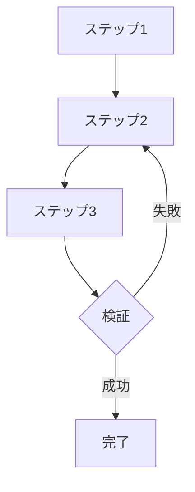

# Agent Skills テンプレート集

このドキュメントでは、様々な用途に応じたAgent Skillsのテンプレートを提供します。

---

## テンプレート1: 基本的なSkill

**用途**: シンプルな単一目的のSkill

```markdown
---
name: [動名詞形の名前]
description: [何をするか] + [いつ使うか] + [キーワード/トリガー]
---

# [Skill名]

## 目的
[このSkillが解決する問題を簡潔に説明]

## 使い方

### ステップ1: [最初のステップ]
[具体的な指示]

### ステップ2: [次のステップ]
[具体的な指示]

### ステップ3: [最後のステップ]
[具体的な指示]

## 例

### 例1: [ユースケース名]
```[言語]
[コード例]
```

### 例2: [別のユースケース名]
```[言語]
[コード例]
```

## ベストプラクティス

- [推奨事項1]
- [推奨事項2]
- [推奨事項3]

## よくある問題

### [問題1]
**症状**: [問題の説明]
**解決策**: [解決方法]

### [問題2]
**症状**: [問題の説明]
**解決策**: [解決方法]
```

---

## テンプレート2: ツール制限付きSkill

**用途**: 読み取り専用や特定の操作に限定したいSkill

```markdown
---
name: [動名詞形の名前]
description: [何をするか] + [いつ使うか]. Read-only access.
allowed-tools: Read, Grep, Glob
---

# [Skill名]

## 目的
[このSkillが解決する問題を簡潔に説明]

## 制限事項
このSkillは以下のツールのみ使用します：
- **Read**: ファイルの読み取り
- **Grep**: パターン検索
- **Glob**: ファイル検索

ファイルの編集や作成は行いません。

## チェックリスト

### [カテゴリ1]
- [ ] [チェック項目1]
- [ ] [チェック項目2]

### [カテゴリ2]
- [ ] [チェック項目1]
- [ ] [チェック項目2]

## 実行手順

1. **[ステップ1]**: [Readツールを使用した操作]
2. **[ステップ2]**: [Grepツールを使用した操作]
3. **[ステップ3]**: [Globツールを使用した操作]
4. **[ステップ4]**: [結果の提示]

## 出力フォーマット

```markdown
## [タイトル]

### [セクション1]
- [内容]

### [セクション2]
- [内容]
```
```

---

## テンプレート3: マルチファイルSkill

**用途**: 複雑な機能を持つSkillで、Progressive Disclosureパターンを使用

### SKILL.md
```markdown
---
name: [動名詞形の名前]
description: [何をするか] + [いつ使うか]. Requires [依存パッケージ].
---

# [Skill名]

## クイックスタート

### 基本的な使い方
```[言語]
[シンプルなコード例]
```

### 詳細ガイド
- [機能1]: [link1.md](link1.md)を参照
- [機能2]: [link2.md](link2.md)を参照

### API詳細
詳細なAPI仕様は[reference.md](reference.md)を参照。

## 必要な環境

以下のパッケージが必要です：
```bash
[インストールコマンド]
```

## 基本機能

1. **[機能1]**: [簡潔な説明]
2. **[機能2]**: [簡潔な説明]
3. **[機能3]**: [簡潔な説明]

## ヘルパースクリプト

### [スクリプト1]
```bash
[実行コマンド]
```

### [スクリプト2]
```bash
[実行コマンド]
```

## トラブルシューティング

一般的な問題と解決策は[troubleshooting.md](troubleshooting.md)を参照。
```

### reference.md（詳細ドキュメント）
```markdown
# [Skill名] API リファレンス

## [モジュール1]

### [関数1]
**用途**: [説明]

**パラメータ**:
- `param1` (型): [説明]
- `param2` (型): [説明]

**戻り値**: [説明]

**例**:
```[言語]
[コード例]
```

### [関数2]
[同様の形式]

## [モジュール2]
[同様の形式]
```

---

## テンプレート4: ワークフロー重視のSkill

**用途**: 段階的なプロセスを伴うタスク

```markdown
---
name: [動名詞形の名前]
description: [何をするか] + [いつ使うか].
allowed-tools: [必要なツールをリスト]
---

# [Skill名]

## ワークフロー概要



## ステップ1: [タイトル]

### 目的
[このステップで達成すること]

### 実行
```[言語またはbash]
[コマンドまたはコード]
```

### 確認項目
- [ ] [確認事項1]
- [ ] [確認事項2]

## ステップ2: [タイトル]

### 目的
[このステップで達成すること]

### 実行
```[言語またはbash]
[コマンドまたはコード]
```

### 確認項目
- [ ] [確認事項1]
- [ ] [確認事項2]

## ステップ3: [タイトル]

### 目的
[このステップで達成すること]

### 実行
```[言語またはbash]
[コマンドまたはコード]
```

### 確認項目
- [ ] [確認事項1]
- [ ] [確認事項2]

## 検証ステップ

以下を確認してください：
- [ ] [検証項目1]
- [ ] [検証項目2]
- [ ] [検証項目3]

**検証が失敗した場合**: ステップ2に戻って修正

## 完了条件

- [ ] すべての検証項目が✅
- [ ] [追加の完了条件]

## トラブルシューティング

### [よくある問題1]
**症状**: [説明]
**原因**: [原因]
**解決策**: [解決方法]

### [よくある問題2]
**症状**: [説明]
**原因**: [原因]
**解決策**: [解決方法]
```

---

## テンプレート5: 検証ループ付きSkill

**用途**: 反復的な改善プロセスが必要なタスク

```markdown
---
name: [動名詞形の名前]
description: [何をするか] + [いつ使うか]. Implements validation loops for quality assurance.
---

# [Skill名]

## 検証ループワークフロー

```
1. [初期処理]
   ↓
2. バリデーター実行
   ↓
3. エラー検出？
   ├─ YES → 修正 → 2に戻る
   └─ NO → 完了
```

## ステップ1: 初期処理

### 実行
```[言語]
[初期処理のコード]
```

## ステップ2: バリデーター実行

### 検証ルール

#### ルール1: [検証項目]
```[言語]
[検証コード]
```

#### ルール2: [検証項目]
```[言語]
[検証コード]
```

#### ルール3: [検証項目]
```[言語]
[検証コード]
```

### エラーの記録
```[言語]
errors = []
# エラーを記録
if [条件]:
    errors.append("[エラーメッセージ]")
```

## ステップ3: エラー修正

### 一般的な修正パターン

#### エラータイプ1
**検出**: [検出方法]
**修正**:
```[言語]
[修正コード]
```

#### エラータイプ2
**検出**: [検出方法]
**修正**:
```[言語]
[修正コード]
```

## ステップ4: 再検証

エラーがなくなるまでステップ2〜3を繰り返す。

## ステップ5: 最終確認と保存

### 最終チェックリスト
- [ ] すべてのバリデーションルールに合格
- [ ] [追加の確認項目]
- [ ] [追加の確認項目]

### 保存
```[言語]
[保存処理のコード]
```

## ベストプラクティス

- 各ループで改善を記録
- 無限ループを避けるため最大反復回数を設定
- 修正内容をログに記録
```

---

## テンプレート6: データ分析Skill

**用途**: データの読み込み、分析、可視化

```markdown
---
name: Analyzing [データタイプ]
description: Load, analyze, and visualize [データタイプ] data. Use when working with [データタイプ] files, data analysis tasks, or generating insights from [データタイプ].
allowed-tools: Read, Write, Bash
---

# Analyzing [データタイプ]

## データ読み込み

### 対応フォーマット
- [フォーマット1]: [説明]
- [フォーマット2]: [説明]

### 読み込みコード
```python
import pandas as pd

# [フォーマット1]の読み込み
df = pd.read_[format]("[ファイル名]")

# データの確認
print(df.head())
print(df.info())
print(df.describe())
```

## データクリーニング

### チェックリスト
- [ ] 欠損値の確認と処理
- [ ] 重複レコードの確認
- [ ] データ型の確認と変換
- [ ] 異常値の検出

### クリーニングコード
```python
# 欠損値の処理
df = df.dropna()  # または fillna()

# 重複の削除
df = df.drop_duplicates()

# データ型の変換
df["[カラム名]"] = df["[カラム名]"].astype([型])
```

## データ分析

### 基本統計
```python
# 記述統計
print(df.describe())

# カラム別統計
print(df["[カラム名]"].value_counts())
```

### グループ分析
```python
# グループごとの集計
grouped = df.groupby("[カラム名]").agg({
    "[集計カラム1]": "sum",
    "[集計カラム2]": "mean"
})
print(grouped)
```

### 相関分析
```python
# 相関行列
correlation = df.corr()
print(correlation)
```

## データ可視化

### 基本的なプロット
```python
import matplotlib.pyplot as plt

# ヒストグラム
df["[カラム名]"].hist(bins=30)
plt.title("[タイトル]")
plt.xlabel("[X軸ラベル]")
plt.ylabel("[Y軸ラベル]")
plt.show()
```

### 複数プロット
```python
# サブプロット
fig, axes = plt.subplots(2, 2, figsize=(12, 10))

df["[カラム1]"].hist(ax=axes[0, 0])
df["[カラム2]"].hist(ax=axes[0, 1])
df.plot(x="[X]", y="[Y]", ax=axes[1, 0])
# etc...

plt.tight_layout()
plt.show()
```

## レポート生成

### 分析結果のまとめ
```python
report = f"""
# データ分析レポート

## データ概要
- レコード数: {len(df)}
- カラム数: {len(df.columns)}
- 期間: {df["[日付カラム]"].min()} ~ {df["[日付カラム]"].max()}

## 主要な発見
- [発見1]
- [発見2]
- [発見3]

## 推奨事項
- [推奨1]
- [推奨2]
"""

print(report)
```

## ベストプラクティス

- データのバックアップを取る
- 段階的に処理を進める
- 各ステップで結果を確認
- 可視化で異常値を検出
```

---

## カスタマイズガイド

これらのテンプレートを使用する際：

1. **[括弧]内をプロジェクト固有の内容に置き換え**
2. **不要なセクションを削除**
3. **必要に応じて新しいセクションを追加**
4. **descriptionを具体的に書き換え**（キーワード・トリガーを含む）
5. **実際のユースケースに基づいた例を追加**

## テンプレート選択のガイドライン

| 目的 | 推奨テンプレート |
|------|------------------|
| シンプルなタスク | テンプレート1: 基本的なSkill |
| 読み取り専用操作 | テンプレート2: ツール制限付きSkill |
| 複雑な機能 | テンプレート3: マルチファイルSkill |
| 段階的プロセス | テンプレート4: ワークフロー重視のSkill |
| 反復改善 | テンプレート5: 検証ループ付きSkill |
| データ処理 | テンプレート6: データ分析Skill |

## 次のステップ

1. 適切なテンプレートを選択
2. プロジェクト固有の内容にカスタマイズ
3. 具体的な例を追加
4. チームメンバーとテスト
5. フィードバックを元に改善
